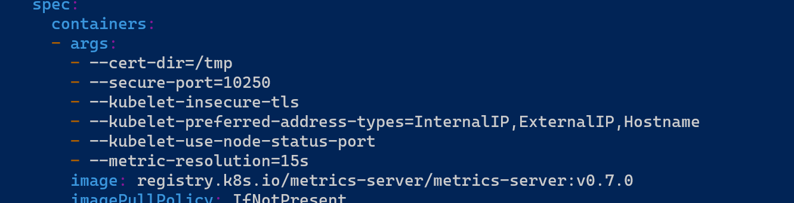

# Creating Kubernetes Cluster Using Kubeadm:
My focus is not to have a long documentation about Kubernetes working and it’s architecture but more emphasis on how these commands and tools work in conjunction to make up our cluster. All these commands can be executed individually  step by step or run in a single script. When run individually we can find out  what really goes into creating a Kubernetes Cluster. 

These scripts have been tested on both Ubuntu 20.04 and 22.04 editions. I recommend 20.04 edition if possible because I have used this extensively in my own lab. The only difference regarding 22.04 that I came across was that while running scripts, the following  message  kept occurring which can be ignored. 


## Pre-requisites and Other Assumptions
- Knowledge of both Linux and Kubernetes. 
- 1 VM for Control Plane
- 2 VMs for Worker Nodes
- Installed OS: Ubuntu 20.04 or 22.04

You can either have these VMs in your own home lab or in the Cloud. Mine are in the  cloud. I have some usage of DigitalOcean free tier remaining, which I will be making use of. As long as you are using Ubuntu 20.04  or 22.04  make sure that the networking is properly configured, you should not have any problem to follow along.

## Agenda:

- Creating a Cluster of one Control Node and two Worker nodes with the following components;
	    - CRI-O container instead of ContainerD or Docker.
	    - Calico instead of Weave.

- installing nfs-server on Control node and nfs-clients on Workers.
	
- Installing Metrics-Server
	
- Installing Helm
	
- Create a Pod/Deployment, expose it and use it with Ingress.
## Notes:

Please  Do not run scripts without reading and making some adjustments to it first. Especially the ‘OS’ and ‘VER’ variables. The rest should be all good.

 Throughout the instructions set, we will be using root account. Most of the commands in here need root privileges, so it’s just easier to stay in root. Not a best practice for production env.


I have 3 sets of shell scripts, they all are very simple so that we can focus on commands & tools.
I am not going to explain these scripts in here . I will encourage you to rather read them yourself. Instead of  making  these script executable, you can use the sh command like so;
```
#sh     NAME_OF_SCRIPT.sh
```
Now that all this out of the way lets just have some fun with it. Let’s Do this.
```
1- run_on_all.sh:
```
This will be run on all the nodes. Workers and Control/Master
```	
2-  run_on_master.sh
3- run_on_master-extra
```
These two scripts should be run on Control/Master node only.

After finished executing all the scripts you should be able to execute the following command;

Pic-1:

And the one in pic-2

pic-2: 


If You haven't  modified Metrics-Server deployment already please do so by;
```	
# kubectl -n kube-system edit deployment metrics-server
```	
And Then add `‘--kubelet-insecure-tls’`  as show in pic-3.

Pic-3;


You can try the following command now;

Pic-4:

# Now Lets test our ingress:

To install and create ingress we will need to use Helm which is an awesome tool that helps you manage Kubernetes applications. Helm Charts help you 	define, install, and upgrade the most complex Kubernetes applications. 

1-
```	
# helm upgrade   --install   ingress-nginx    ingress-nginx   --repo  https://kubernetes.github.io/ingress-nginx   --namespace  ingress-nginx   --create-namespace
```	

2-
```	
# kubectl get ingressclass
```	
To test out our Ingress we will Create a Deployment that will make use of nginx image;
```	
# kubectl  create  deployment  nginxingress   --image=nginx   --port=80
```	
Let’s expose this deployment;
```	
#  kubectl expose deployment nginxingress --name nginxingress-service --type=ClusterIP --port=8085 –target-port=80
```	
Once done exposing our deployment, we are going to create ingress for it;
```	
#  kubectl create ingress nginxingress-ingress --class=nginx --rule="foolish.com/*=nginxingress-service:8085"
```	   
We are using a host  called `foolish.com` which we have not set up yet. In order to do that and to test our newly create service and ingress , let’s add this host  to our local hosts file `/etc/hosts` like shown in pic-5.  
```	
# vi /etc/hosts
```	
Pic-5

```
#  kubectl get svc -n ingress-nginx
# kubectl port-forward -n ingress-nginx  svc/ingress-nginx-controller 8085:80
```
To send this to background and keep it running use the following to commands
```
# CTRL-Z
#  bg
```
Now if you try the following command we should see something similar to our pic-6;
```
#  curl foolish.com:8085
```
Pic-6


let’s just kill our background process;
```
#  fg
# CTRL-C
```

# Storage Class:

in order to use storage class, first we need to install `‘nfs-server’` on Control Node, create an export directory `‘/nfsexports’`.

On Control Node:
```
# mkdir /nfsexports
# apt install   -y  nfs-server 
# vi /etc/exports
```
add  the following entry to /etc/exports;
```
/nfsexports     *(rw,no_root_squash)’ 
```
## WARNING: As this is our home lab, hence use of ‘no_root_squash’. Else not Recommended. 

Pic-7


```
# systemctl restart nfs-server.service
```
To varify everything went well try ;
```
# showmount -e
```
Use the following to get ip of the control node which we will need to configure clients  on Worker Nodes
```
# curl ifconfig.me
```
On Workder Node:
```
# apt install  -y    nfs-client
```
To varify;
```
# showmount -e  IP_OF_CONTROL_NODE
```

Now we can go ahead and install StorageClass with help of Helm.

step-1
```
# helm repo add nfs-subdir-external-provisioner https://kubernetes-sigs.github.io/nfs-subdir-external-provisioner/
"nfs-subdir-external-provisioner" has been added to your repositories
```
step-2
```
# helm install nfs-subdir-external-provisioner nfs-subdir-external-provisioner/nfs-subdir-external-provisioner --set nfs.server=167.172.60.211 --set nfs.path=/nfsexports
```

step-3
If you everything went well after executing the following;
```
# kubectl get pods
```

You should see 
```
nfs-subdir-external-provisioner-SOME-RANDOM-VALUE-HERE.
```


After this you can create a PVC without having to create a PV first, but we are not fully done yet. 
If every time we create a PVC and not have to deal with entering storage-class name then we will have to make our storage-class ‘nfs-client’ a default storage-class which by the way we have not yet done so.

To do that let’s edit our storage-class;
```
# kubectl edit storageclass nfs-client
```

Add the following line;
```
storageclass.kubernetes.io/is-default-class: "true"
```        

now our storage-class should look something similar to the one  below;
==============================================
```
apiVersion: v1
items:
- allowVolumeExpansion: true
  apiVersion: storage.k8s.io/v1
  kind: StorageClass
  metadata:
    annotations:
      meta.helm.sh/release-name: nfs-subdir-external-provisioner
      meta.helm.sh/release-namespace: default
### here################################
      storageclass.kubernetes.io/is-default-class: "true"
    creationTimestamp: "2024-03-02T13:30:19Z"
    labels:
      app: nfs-subdir-external-provisioner
      app.kubernetes.io/managed-by: Helm
      chart: nfs-subdir-external-provisioner-4.0.18
      heritage: Helm
      release: nfs-subdir-external-provisioner
    name: nfs-client
    resourceVersion: "14391"
    uid: 1f5399e3-f911-4f5a-9373-bb4eadb06a5a
  parameters:
    archiveOnDelete: "true"
  provisioner: cluster.local/nfs-subdir-external-provisioner
  reclaimPolicy: Delete
  volumeBindingMode: Immediate
kind: List
metadata:
  resourceVersion: ""
```
==============================================
After this we don’t have to specify ‘storageClassName’ in our PVC command whether that be a Imperative and Declarative.


This should conclude our lab. 
Thanks.


